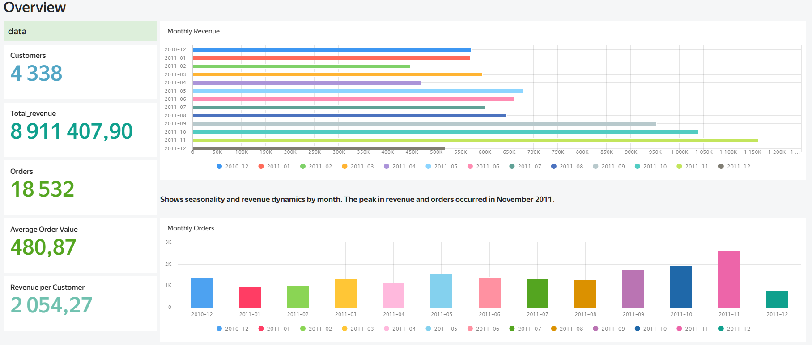
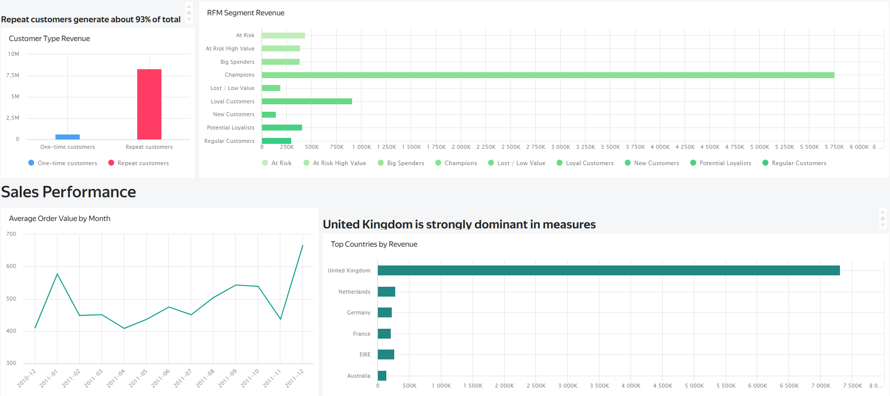
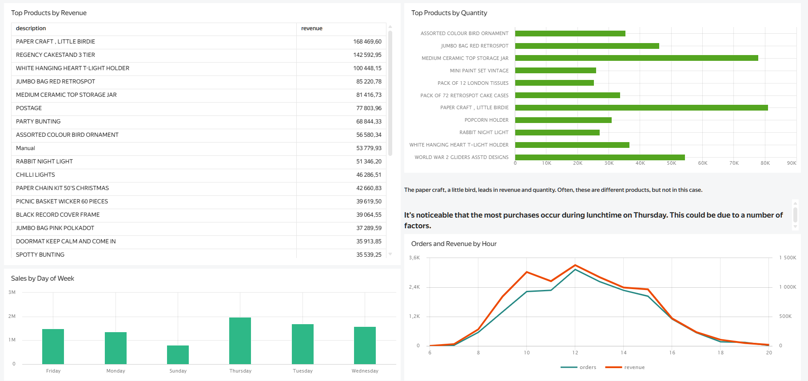
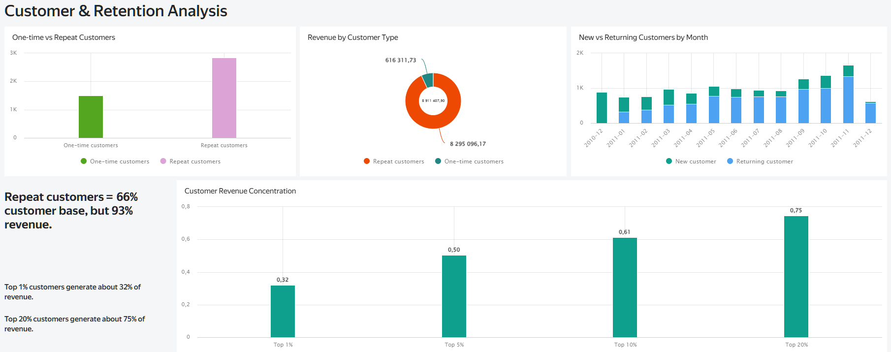
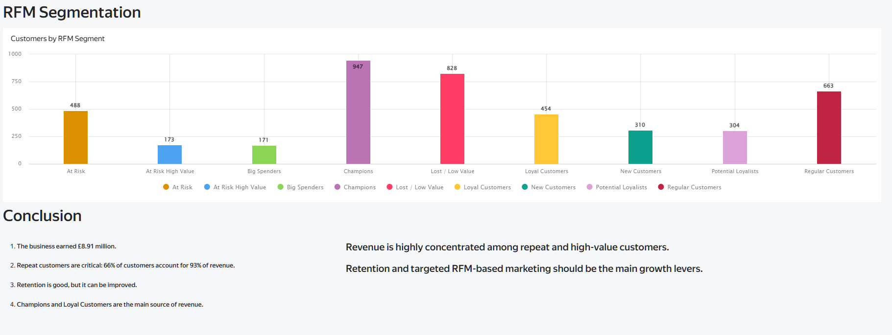

# E-commerce Sales Analytics

End-to-end e-commerce analytics project focused on sales performance, customer behavior, cohort retention and RFM segmentation.

## на русском

**Цель проекта:** проанализировать транзакционные данные интернет-магазина, определить ключевые источники выручки, оценить поведение клиентов, удержание и сегменты покупателей.

**Описание проекта:** в проекте выполнена очистка данных, анализ продаж, customer analysis, cohort retention и RFM-сегментация. Результаты подготовлены для дальнейшего построения BI-dashboard в Yandex DataLens или Tableau.

---
## Dataset Source

This project uses the **Online Retail** dataset from the UCI Machine Learning Repository.

Dataset page: https://archive.ics.uci.edu/dataset/352/online+retail

Citation:

> Chen, D. (2015). Online Retail [Dataset]. UCI Machine Learning Repository. https://doi.org/10.24432/C5BW33

The dataset is licensed under the **Creative Commons Attribution 4.0 International (CC BY 4.0)** license.

Original dataset description:

> This is a transactional dataset containing all transactions occurring between 01/12/2010 and 09/12/2011 for a UK-based and registered non-store online retail business.
> 
> 
> ---

## Project Overview

This project analyzes online retail transaction data to answer business questions related to revenue, customer behavior and customer segmentation.

The analysis covers:

- data cleaning and preparation;
- sales performance analysis;
- customer behavior analysis;
- cohort retention analysis;
- RFM segmentation;
- SQL-based analytical queries.
- 
The dashboard is planned as a separate next step using **Yandex DataLens** 

## Questions

The project answers the following questions:

1. How does revenue change over time?
2. Which countries and products generate the most revenue?
3. How much does the business depend on repeat customers?
4. What is the customer retention pattern by monthly cohorts?
5. Which customers are the most valuable?
6. Which customer segments should be prioritized for marketing and retention?

## Dataset

The project uses the **Online Retail** transaction dataset.

Main fields:

| Column | Description |
|---|---|
| `InvoiceNo` | Invoice/order number |
| `StockCode` | Product code |
| `Description` | Product description |
| `Quantity` | Number of purchased items |
| `InvoiceDate` | Transaction date and time |
| `UnitPrice` | Product unit price |
| `CustomerID` | Customer identifier |
| `Country` | Customer country |

After cleaning, the full processed dataset contains:

| Metric | Value |
|---|---:|
| Raw rows | 541,909 |
| Clean rows | 397,884 |
| Orders | 18,532 |
| Customers | 4,338 |
| Products | 3,665 |
| Countries | 37 |
| Total revenue | £8.91M |
| Date range | 2010-12-01 — 2011-12-09 |

## Data Cleaning

The cleaning process removes records that are not suitable for core sales and customer analytics:

- cancelled invoices;
- negative or zero quantities;
- zero or invalid prices;
- rows without `CustomerID`;
- inconsistent records not suitable for customer-level analysis.

Additional fields were created:

- `line_revenue`;
- `invoice_day`;
- `invoice_month`;
- `invoice_year`;
- `invoice_hour`;
- `day_of_week`.

## Project Structure

```text
E-commerce-Analytics/
├── README.md
├── requirements.txt
├── prepare_data.py
├── data/
│   └── processed/
│       ├── online_retail_clean.csv
│       ├── orders.csv
│       ├── monthly_sales.csv
│       ├── country_sales.csv
│       ├── customer_metrics.csv
│       ├── customer_type_summary.csv
│       ├── customer_revenue_concentration.csv
│       ├── cohort_retention.csv
│       ├── cohort_retention_full_months.csv
│       ├── cohort_summary.csv
│       ├── average_retention_by_period.csv
│       ├── customers_rfm.csv
│       └── ecommerce_analytics.sqlite
├── notebooks/
│   ├── 02_sales_analysis.ipynb
│   ├── 03_customer_analysis.ipynb
│   ├── 04_cohort_retention.ipynb
│   └── 05_rfm_segmentation.ipynb
└── sql/
    ├── 01_create_tables.sql
    ├── 02_sales_metrics.sql
    ├── 03_customer_metrics.sql
    ├── 04_cohort_retention.sql
    └── 05_rfm_segmentation.sql
```

## Analysis Workflow

### 1. Data Preparation

Script:

```bash
python prepare_data.py
```

Outputs:

```text
data/processed/online_retail_clean.csv
data/processed/orders.csv
```

### 2. Sales Analysis

Notebook:

```text
notebooks/02_sales_analysis.ipynb
```

Main outputs:

```text
monthly_sales.csv
country_sales.csv
hourly_sales.csv
```

This part analyzes:

- total revenue;
- monthly revenue;
- number of orders;
- average order value;
- country-level performance;
- product-level performance;
- revenue by weekday and hour.

### 3. Customer Analysis

Notebook:

```text
notebooks/03_customer_analysis.ipynb
```

Main outputs:

```text
customer_metrics.csv
customer_type_summary.csv
customer_revenue_concentration.csv
monthly_customer_type.csv
```

This part analyzes:

- one-time vs repeat customers;
- repeat purchase rate;
- revenue concentration;
- top customers;
- new vs returning customers by month.

### 4. Cohort Retention

Notebook:

```text
notebooks/04_cohort_retention.ipynb
```

Main outputs:

```text
cohort_retention.csv
cohort_retention_full_months.csv
cohort_summary.csv
average_retention_by_period.csv
cohort_revenue.csv
```

This part analyzes:

- monthly customer cohorts;
- month-by-month retention;
- average retention by period;
- cohort-level revenue.

### 5. RFM Segmentation

Notebook:

```text
notebooks/05_rfm_segmentation.ipynb
```

Main output:

```text
customers_rfm.csv
```

This part segments customers using:

| RFM Component | Meaning |
|---|---|
| Recency | How recently the customer purchased |
| Frequency | How often the customer purchased |
| Monetary | How much revenue the customer generated |

Customer segments include:

- Champions;
- Loyal Customers;
- Potential Loyalists;
- New Customers;
- Big Spenders;
- At Risk High Value;
- At Risk;
- Lost / Low Value;
- Regular Customers.

## Findings

### Sales Performance

- The business generated **£8.91M** in total revenue.
- The dataset contains **18,532 orders** from **4,338 customers**.
- The average order value is approximately **£480.86**.
- The United Kingdom is the dominant market and generates the majority of revenue.
- December 2011 is incomplete because the dataset ends on **2011-12-09**, so it should not be directly compared with full months.

### Customer Behavior

- Repeat customers represent **65.6%** of all customers.
- Repeat customers generate **93.1%** of total revenue.
- One-time customers represent **34.4%** of customers but generate only **6.9%** of revenue.
- The top **1%** of customers generate approximately **32.0%** of revenue.
- The top **5%** of customers generate approximately **50.4%** of revenue.
- The top **20%** of customers generate approximately **75.0%** of revenue.

### Cohort Retention

- Average month-1 retention is approximately **21%**.
- Average month-3 retention is approximately **23%**.
- Average month-6 retention is approximately **24%**.
- The strongest cohort is **2010-12**, with **885 customers** and approximately **£4.51M** in total revenue.
- Retention analysis confirms that repeat customers are critical for long-term revenue.

### RFM Segmentation

- The **Champions** segment contains **947 customers**, or **21.8%** of the customer base.
- Champions generate approximately **£5.76M**, or **64.6%** of total revenue.
- **Champions + Loyal Customers** represent **32.3%** of customers and generate **74.8%** of revenue.
- **Lost / Low Value** customers represent **19.1%** of the customer base but generate only **2.1%** of revenue.
- The top 10 RFM customers generate approximately **£1.34M**, or **15.1%** of total revenue.

## SQL Analysis

The project also includes SQL queries for analytical reporting:

```text
sql/02_sales_metrics.sql
sql/03_customer_metrics.sql
sql/04_cohort_retention.sql
sql/05_rfm_segmentation.sql
```

SQL analysis covers:

- revenue and order metrics;
- monthly sales;
- country performance;
- product performance;
- repeat purchase rate;
- customer concentration;
- cohort retention;
- RFM segments.

A SQLite database can be used for local SQL analysis:

```text
data/processed/ecommerce_analytics.sqlite
```

## Dashboard 

An interactive dashboard was built in **Yandex DataLens** to summarize the main business insights from the analysis.
The dashboard includes:

- sales performance overview;
- monthly revenue and orders;
- country and product performance;
- one-time vs repeat customer analysis;
- cohort retention;
- RFM customer segmentation.








https://datalens.ru/7hot6vhrvgmqr

## Tools Used

- Python
- pandas
- NumPy
- Jupyter Notebook
- SQLite
- SQL
- Matplotlib
- Seaborn

## How to Run

Install dependencies:

```bash
pip install pandas numpy matplotlib seaborn jupyter openpyxl sqlalchemy
```

Run data preparation:

```bash
python prepare_data.py
```

Open notebooks:

```bash
jupyter notebook
```

Run notebooks in order:

```text
02_sales_analysis.ipynb
03_customer_analysis.ipynb
04_cohort_retention.ipynb
05_rfm_segmentation.ipynb
```

## Notes and Limitations

- December 2011 is incomplete and should be interpreted carefully.
- Rows without `CustomerID` were removed from customer-level analysis.
- Cancelled invoices and invalid transaction rows were excluded from the main sales analysis.
- The project focuses on historical descriptive analytics and does not include predictive modeling.
